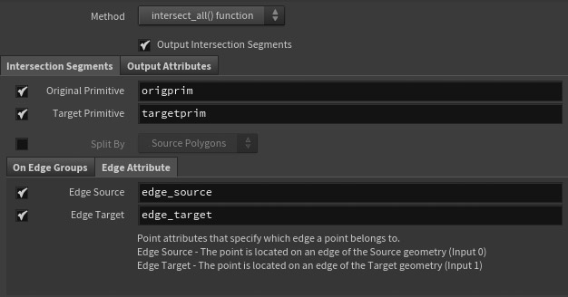
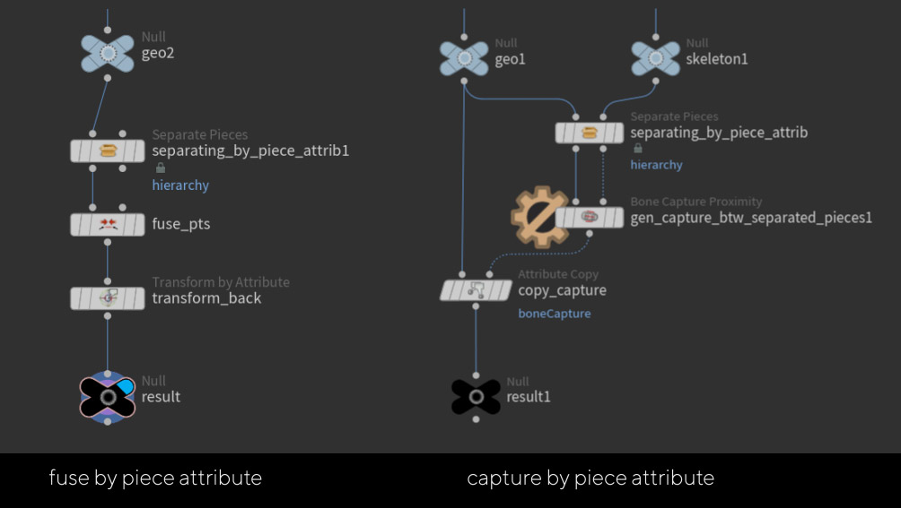
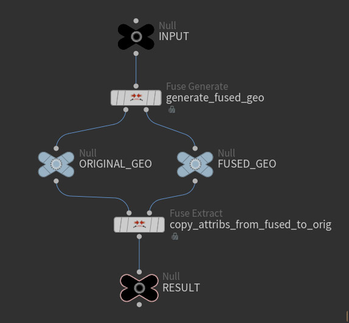
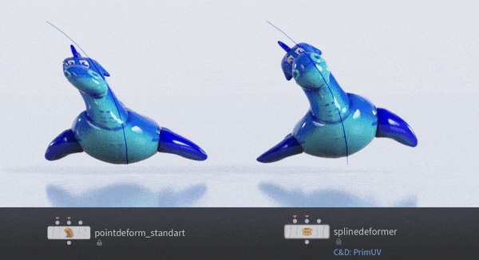
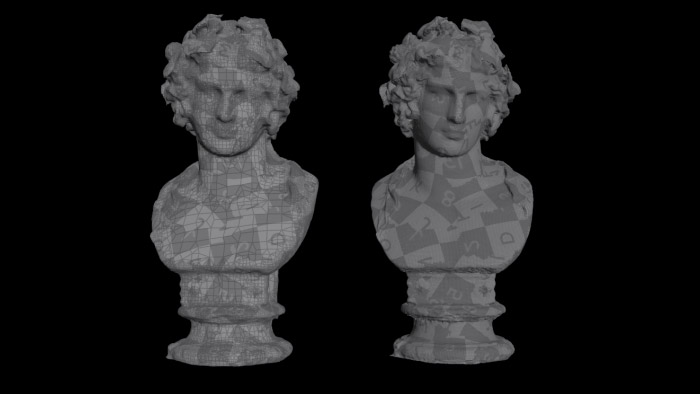
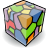
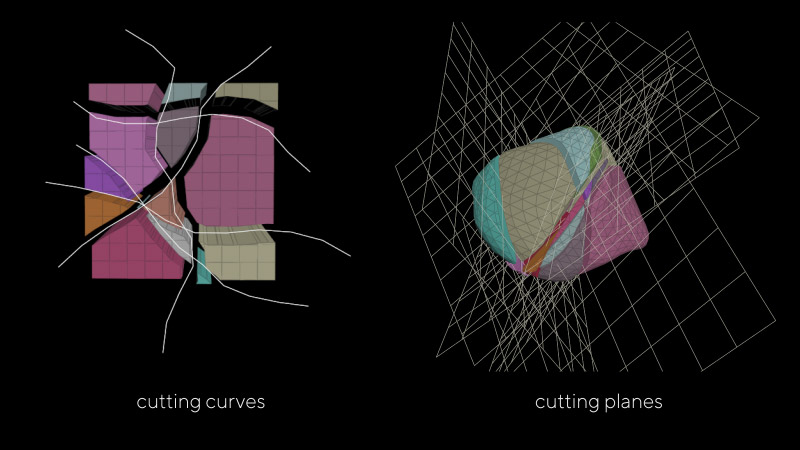
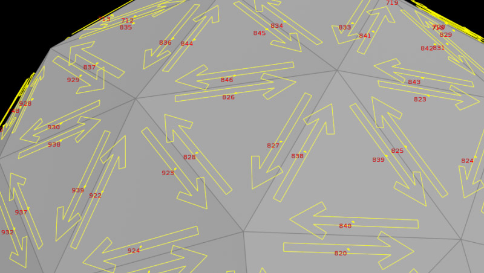

# VEX-Snippets

## Basic 3D Graphics Functions (Intersection / Nearest Distance / Projection) 

### [Intersection Functions](VEX/Intersection)
I was trying to explore how intersections work in 3D graphics, so I made a collection of basic functions designed to find intersections in 3D space.
These functions cover various intersection scenarios, including:

- **Line-Line**
- **Segment-Segment**
- **Segment-Curve**
- **Line-Plane**
- **Plane-Plane**
- **Segment-Triangle**
- **Triangle-Triangle**
- **Segment-Planar Quad**
- **Segment-Bilinear Patch** (both planar and non-planar quad)

Based on this research I developed the  which improves precision of boolean fracturing as well as the  node.

### [Nearest Distance (Geometric Tools)](VEX/NearestDistance)
This collection of functions is designed to find the nearest distances between various geometric entities.  
Based on functions from [Geometric Tools](https://github.com/davideberly/GeometricTools/):

- **dist_point_segment**
- **dist_segment_segment**
- **dist_line_line**
- **dist_line_segment**
- **dist_line_triangle**
- **dist_pt_triangle**
- **dist_segment_triangle**
- **dist_triangle_triangle**

### [Projection](VEX/Projection)
Projection simply involves finding the minimal distance.
This can be achieved using [Near Distance Functions](VEX/NearestDistance) (Geometric Tools Functions).

However, I found another implementations that might also be useful.
These functions project a point onto: line, segment, plane, triangle, planar and non-planar quad.
  

# HIPs

## Solvecurve() / Solveik()
- Example file demonstrating the use of *solvecurve()* and *solveik()* functions in VEX.
    

  

# Nodes

## Edge Preservation
Houdini’s basic nodes don't always preserve edge groups well during geometry operations. This collection of nodes is designed to handle geometry while maintaining edge groups.

These nodes were developed during the creation of my **custom Boolean fracture system**, which can be found in the  repo.

-  **Transfer Edge**: More accurate edge group transfer compared to Transfer Groups.  
-  **Fuse Preserve Edges**: Fuses points while keeping edge groups intact.  
-  **Remesh Preserve Edges**: Remeshes geometry while transferring and preserving edge groups.  
-  **Copy Edge Groups**: Copies edge groups, with an option to copy by ID.  

## Intersection and Shattering
These nodes were created to better understand intersection operations in Houdini.

-  **Intersection Analysis Custom:** A custom version of the **Intersection Analysis node**, which can be slightly faster than the original. Like the original node, it can store *@sourceprim*, *@sourceinput*, and *@sourceprimuv* attributes. 
Additionally, it can **split lines** based on the primitives they belong to and store information about which **edges** points are associated with.
    

-  **Surface Shatter**: A basic version of a **Boolean shatter** node using Surface Mode. This node is a work in progress, and I'm continuing to improve it. It offers two methods for generating cutting surfaces, though it is still somewhat clunky.

## Handling Pieces

-  **Separate Pieces**: This node is essential for **processing multiple pieces**. It separates pieces from each other using their piece attribute, allowing you to iterate through them simultaneously. This is useful for tasks like **generating captures** between identical pieces, **transferring attributes**, or **fusing by pieces**. It is much faster than using a foreach loop or piece groups. This method is based on the "Point Deform" node.
  

-  **Bound Pieces** - generate bound for pieces
-  **Match Size Piece** - make Match Size for pieces

## Useful for simulations

-  **Dejitter**: Removes jittering from animated points over time, especially useful for handling jittery simulations like cloth.
    

-  **Fuse Generate / Fuse Extract**: A pair of nodes for fusing points and extracting values from the fused points.
	- **Fuse Generate**: Fuses points and generates attributes for use with the Fuse Extract node.

	- **Fuse Extract**: Extracts attributes from fused geometry and applies them to unfused geometry. These nodes are useful for simulations where geometry needs to be fused, such as simulating cloth or wires. After the simulation, the animated attributes are transferred back to the original unfused geometry.
  
## Deformation and Skeleton Export

- **RBD to FBX**: Converts rigid body animations into skeletal animations, allowing export in FBX format. This is useful for transferring RBD simulations into skeletal animations for game engines.

- **Deform to FBX**: Converts deforming geometry into skeletal animations, exportable in FBX format. Ideal for simulations such as cloth or soft bodies, with support for tearing cloth from Vellum. It can handle multiple pieces and offers four capture methods.

- **Wire to FBX**: Converts wire simulations from Vellum into skeletal animations for export in FBX format. Useful for wires, hair, string, and similar simulations. This node supports both intact and broken wires and works with multiple separate wires. Offers three capture methods.

-  **pCapt to boneCapt**: Converts point capture data to bone capture data (*@pCaptPts* to *@boneCapture*). This node allows to generate capture data between geometry and a skeleton using Point Deform, then convert it to **bone capture deformation**. Result will be work with the **Bone Deform** node.
  

- **Spline Deformer**: Deforms geometry based on a spline, capable of handling multiple pieces. It uses **primitive UVW** and **point deformation** and has an OpenCL implementation for better performance.
    

## Additional Nodes

-  **UV Transfer**: Transfers UVs from one geometry to another. It's similar to the **Labs UV Transfer** node but much, much faster.
     
  

-  **RBD Guided Voronoi**: This node enhances Voronoi fracturing by using curves or planes as guides. It was developed during the search for a more precise solution to fracture geometry. While Voronoi fractures are accurate and stable, they often lack flexibility. This node makes the Voronoi fracture process more controllable.
     

-  **View Hedges**: A node for visualizing half-edges (hedges). It can generate visualizer markers to display hedge numbers.
     

